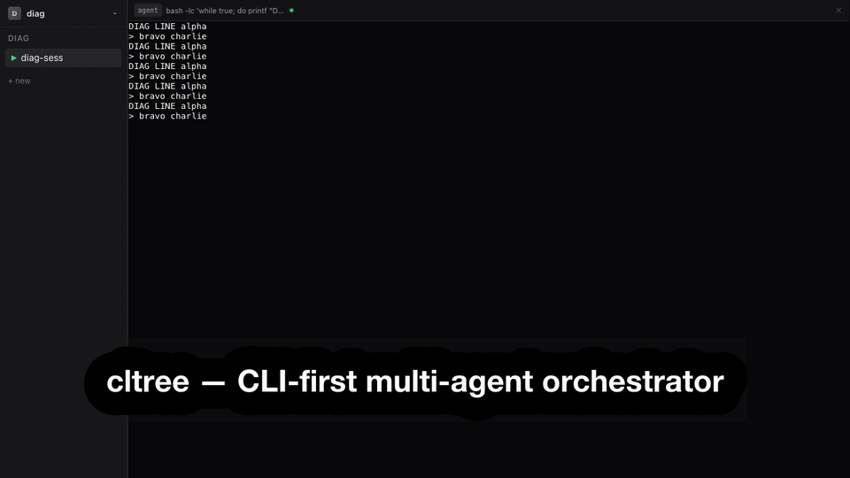

# cltree

CLI-first multi-agent 오케스트레이터. node-pty 기반 PTY 관리 + React/xterm.js 웹 렌더링.

## 데모



> 하나의 워크스페이스, 하나의 세션에서 왼쪽엔 Claude Code 에이전트, 오른쪽엔 그 에이전트가 작업 중인 GitHub 이슈를 GUI pane으로 — 단일 오케스트레이터 안에서 나란히.

고화질 MP4: [`docs/demo/demo.mp4`](docs/demo/demo.mp4) · 영문 자막: [`docs/demo/captions.srt`](docs/demo/captions.srt) · `pnpm demo` 로 재녹화 가능 ([`scripts/demo/README.md`](scripts/demo/README.md) 참고)

## 핵심 원칙

- **CLI = 유일한 인터페이스**: 모든 기능은 `cltree` CLI로 접근 가능
- **웹 UI = CLI의 시각화**: 모든 UI 인터랙션 = 내부 CLI 명령 실행. 별도 로직 없음
- **Agent = CLI 사용자**: Agent는 `cltree` CLI를 도구로 호출. 사람과 동일한 경로
- **메인 프로세스 = 단일 진실 소스**: CLI → HTTP → 메인 프로세스 → SQLite/PTY → 웹 UI 반영
- **node-pty = PTY 관리 레이어**: Agent/Terminal은 node-pty PTY (진짜 셸). xterm.js는 렌더링 전용

## 아키텍처

```
cltree (Node.js 단일 프로세스, 최상위 오케스트레이터)
├── NestJS HTTP/WS Gateway
│   ├── React 번들 정적 서빙 (웹 UI)
│   ├── HTTP API (CLI 명령 수신)
│   └── WebSocket (PTY I/O 스트리밍 + 상태 push)
├── node-pty (PTY 프로세스 관리)
├── SQLite (상태 저장)
└── CLI (Commander.js, HTTP 클라이언트 모드)

┌─ Browser / Electron ────────────────────────────────────┐
│ Sidebar (React)  │ PaneGrid (react-resizable-panels)    │
│ ┌──────────────┐ │                                      │
│ │ Sessions     │ │  Terminal (xterm.js)                  │
│ │ ▶ myapp      │ │  $ claude (agent)                    │
│ │   backend    │ │  > ...                               │
│ │              │ ├──────────────────────────────────────│
│ │ +new  ×del   │ │  Terminal (xterm.js)                  │
│ │              │ │  $ pnpm dev                           │
│ │ SlotPanel    │ │  > ready on :3000                     │
│ └──────────────┘ │                                      │
└──────────────────┴──────────────────────────────────────┘
```

→ 상세: [docs/architecture.md](docs/architecture.md) · [docs/pty.md](docs/pty.md)

## 데이터 계층

```
CltreeInstance (1 프로세스)
└── Workspace (1:1)
    └── Sessions[]
        └── Session (repo?, issue?, worktree?)
            ├── children[]      — 서브세션 (이슈 → worktree 분기)
            ├── panes[]         — PTY 참조 (Agent/Terminal)
            └── tui_slots[]     — sidebar 내부 슬롯
```

- **Workspace**: 인스턴스 1개 = Workspace 1개. 여러 repo의 Session이 공존
- **Session**: 작업 단위. 자체 git repo 연결 가능. 1 Session = 1 PTY 그룹
- **서브세션**: 부모 Session의 repo에서 이슈 연동 → git worktree 분기

→ 상세: [docs/session.md](docs/session.md)

## 2종 PTY Pane + Sidebar 슬롯

| 구분 | 역할 | 생성 |
|------|------|------|
| **Agent Pane** | AI CLI 프로세스 (node-pty, 진짜 PTY) | `cltree p spawn` |
| **Terminal Pane** | 로컬 프로세스 (node-pty, 진짜 PTY) | `cltree p attach --cmd "..."` |
| **Sidebar 슬롯** | CLI 출력 → 구조화된 뷰 (React sidebar 내부) | `cltree p push --type <t> --source <s>` |

Sidebar 슬롯은 **빌트인 3종** (`issue`, `markdown`, `tree`)과
**커스텀 슬롯** (사용자가 `~/.cltree/slots/`에 정의, Agent가 재사용)으로 구성.

→ 상세: [docs/panes.md](docs/panes.md)

## CLI 명령어 체계

`cltree <domain> <verb> [flags]` — 2계층. 모든 커맨드는 **다음 가능한 행위(Actions)를 리턴**.

```
cltree                                   # 서버 시작 + 브라우저 열기
cltree status                            # 상태 트리
│
├── session (s)                          # 세션 생명주기
│   ├── list / create / inspect <id>
│   ├── rename <id> / complete <id> / archive <id>
│
├── pane (p)                             # Pane 관리 (Agent·Terminal·슬롯 통합)
│   ├── push --type <t> --source <s>     # sidebar 슬롯 추가
│   ├── spawn / attach --cmd <cmd>       # PTY pane 생성
│   ├── focus <id> / zoom <id>           # pane 제어
│   ├── layout <pattern> / resize / swap
│   ├── ls / kill <id>
│   └── slots                            # 슬롯 타입 목록
│
├── repo (r)                             # Git repo · worktree
│   ├── attach <repo> / detach / info
│   └── worktrees / cleanup
│
├── ctx (c)                              # 맥락 교환
│   ├── send --to <id> <msg>
│   └── history <id>
│
└── config (cfg)                         # 설정
    ├── get [key] / set <key> <value>
    └── init / cleanup / check
```

공통 플래그: `--json, -j` (Agent 파싱용) · `--project, -P` · `--config, -c`

→ 상세: [docs/cli.md](docs/cli.md)

## Agent 연동

| 패턴 | 방법 | 상태 |
|------|------|------|
| Agent → Sidebar 슬롯 | `cltree p push` | ✓ |
| Agent → new Agent | `cltree p spawn` | ✓ |
| Agent ← 다른 Agent 맥락 (pull) | `s inspect` + `p history --last N` + git | ✓ |
| Agent → 기존 Agent 직접 전달 | 실시간 push 불가 | ✗ |

→ 상세: [docs/agent.md](docs/agent.md)

## 설정

| 범위 | 경로 |
|------|------|
| 전역 | `~/.config/cltree/config.yaml` |
| 프로젝트 | `.cltree/config.yaml` (오버라이드) |

→ 상세: [docs/config.md](docs/config.md)

## 사전 준비물

- **Node.js 20+** (20~26 검증) 및 **[pnpm](https://pnpm.io/)** (`npm install -g pnpm`)
- **git**
- **Agent CLI** — [`claude`](https://docs.claude.com/en/docs/claude-code), `codex`, `gemini` 중 최소 1개 설치 및 로그인 (기본값: `claude`)
- **[GitHub CLI](https://cli.github.com/) (`gh`)** — 이슈/PR 기능(`--issue`, `gh issue view ...`)에 필요. `gh auth login`으로 1회 로그인

## 설치

> 아직 npm 미발행 — 소스에서 설치합니다.

```bash
git clone https://github.com/wo658/cltree.git
cd cltree
pnpm install
pnpm build
pnpm link --global   # `cltree` 명령을 전역에서 사용 가능하게 함
```

이후 아무 프로젝트 디렉토리에서 실행 (실행한 디렉토리가 기본 세션 cwd가 됩니다):

```bash
cltree    # 서버 시작 + 브라우저 열기
```

> **로컬 개발**(핫 리로드): `pnpm dev` — 서버(`:4870`)와 웹 UI(`:5173`)를 함께 실행.

## 빠른 시작

```bash
cltree                                              # 서버 시작 + 브라우저 열기
cltree s create --repo owner/myapp --name "myapp"   # 세션 생성
cltree s create --parent myapp --issue 42 --spawn   # 이슈 서브세션 + Agent
cltree p push --type issue --source "gh issue view 42"  # sidebar에 이슈 표시
cltree s list                                       # 세션 트리
```

## 기술 스택

- Node.js 20+ / TypeScript
- [NestJS](https://nestjs.com/) (서버 프레임워크) · [React](https://react.dev/) (웹 UI) · [xterm.js](https://xtermjs.org/) (터미널 렌더링) · [shadcn/ui](https://ui.shadcn.com/) + Tailwind CSS (UI 컴포넌트)
- [node-pty](https://github.com/microsoft/node-pty) (PTY 관리) · [better-sqlite3](https://github.com/WiseLibs/better-sqlite3) (상태 저장)
- [react-resizable-panels](https://github.com/bvaughn/react-resizable-panels) (분할창) · [Vite](https://vite.dev/) (프론트 빌드)
- Electron (데스크톱 앱, 추후)